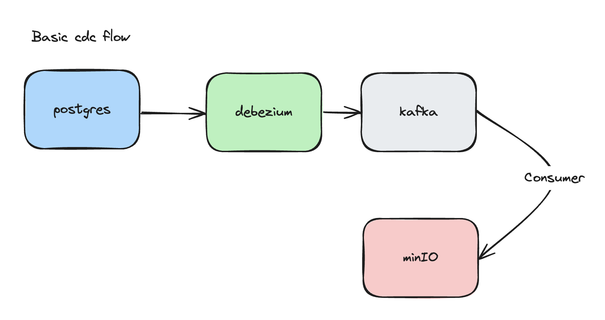

## Overview
This data project demonstrates a basic change data capture (CDC) flow using Apache Kafka, Debezium, and Apache Spark. The project captures data changes from a PostgreSQL database using Debezium, streams these events into Kafka topics, and then processes the events in real-time using Spark Streaming, ultimately writing the processed data as Parquet files to S3.

## Usage
up docker-compose and docker-compose-spark containers

### execute connector
curl -i -X POST -H "Accept:application/json" -H "Content-Type:application/json" localhost:8083/connectors/ --data "@debezium_config.json"

### list kafka topics
kafka-topics --bootstrap-server=localhost:9092 --list

### capture cdc logs for topic
kafka-console-consumer --bootstrap-server localhost:9092 --topic postgres.public.cars --from-beginning
 
### copy local spark script file to spark master
docker cp -L main.py spark_spark-master_1:/opt/bitnami/spark/myscript.py

### submit spark job within spark master container
spark-submit --master spark://172.18.0.9:7077 --packages org.apache.spark:spark-sql-kafka-0-10_2.12:3.4.1,io.delta:delta-core_2.12:2.4.0 myscript.py

